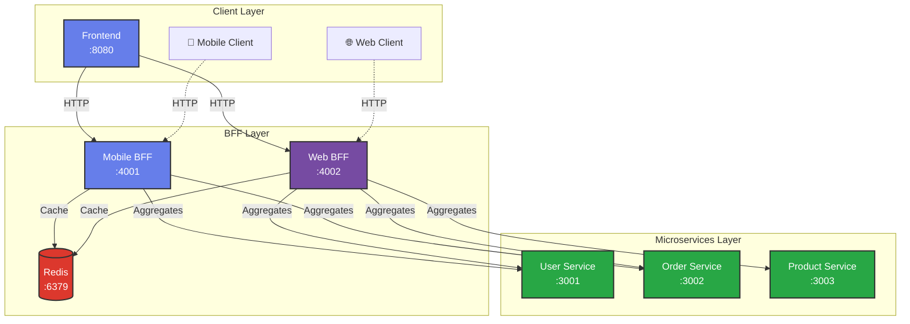
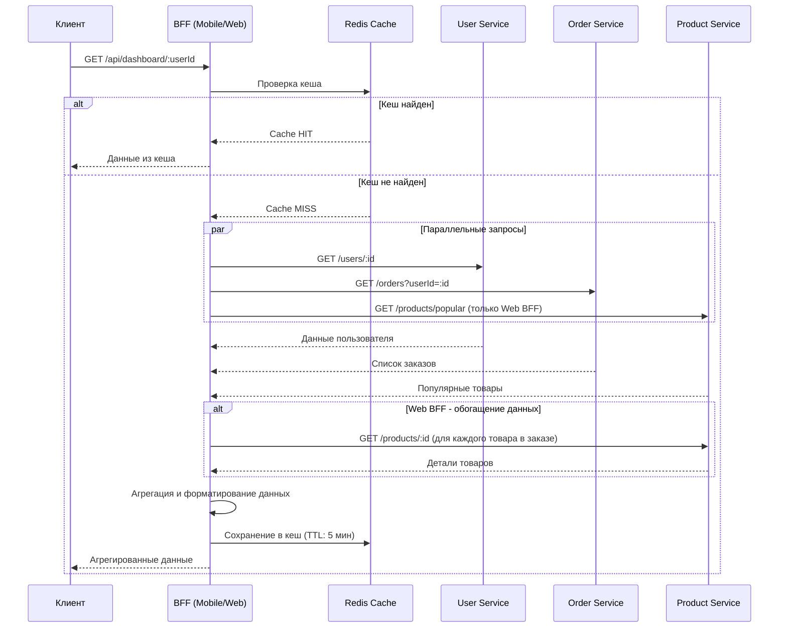

# BFF Demo - E-commerce Dashboard

Демонстрационное приложение паттерна Backend for Frontend (BFF).

## Архитектура



### Компоненты системы:

- **3 микросервиса**: User Service, Order Service, Product Service
- **2 BFF сервиса**: Mobile BFF (порт 4001), Web BFF (порт 4002)
- **Redis**: Кеширование запросов (порт 6379)
- **Frontend**: Веб-интерфейс для демонстрации (порт 8080)

## Запуск

```bash
docker-compose up --build
```

Или в фоновом режиме:
```bash
docker-compose up -d --build
```

После запуска откройте в браузере:
- **Frontend**: http://localhost:8080

## Остановка

```bash
docker-compose down
```

## Эндпоинты микросервисов

### User Service (порт 3001)
- `GET http://localhost:3001/users` - список всех пользователей
- `GET http://localhost:3001/users/:id` - пользователь по ID
- `GET http://localhost:3001/health` - проверка здоровья сервиса

### Order Service (порт 3002)
- `GET http://localhost:3002/orders` - все заказы
- `GET http://localhost:3002/orders?userId=1` - заказы пользователя
- `GET http://localhost:3002/orders/:id` - заказ по ID
- `GET http://localhost:3002/health` - проверка здоровья сервиса

### Product Service (порт 3003)
- `GET http://localhost:3003/products` - все товары
- `GET http://localhost:3003/products?category=electronics` - фильтр по категории
- `GET http://localhost:3003/products?inStock=true` - только в наличии
- `GET http://localhost:3003/products/:id` - товар по ID
- `GET http://localhost:3003/products/popular` - популярные товары
- `GET http://localhost:3003/health` - проверка здоровья сервиса

## Эндпоинты BFF сервисов

### Mobile BFF (порт 4001)
Оптимизированные данные для мобильных клиентов (минимальный объем данных):

- `GET http://localhost:4001/api/dashboard/:userId` - дашборд с упрощенными данными
  - Возвращает: базовую информацию о пользователе, список заказов (без деталей товаров), краткую статистику
- `GET http://localhost:4001/api/user/:id` - упрощенный профиль пользователя
- `GET http://localhost:4001/health` - проверка здоровья сервиса и статуса Redis

**Пример ответа Mobile BFF:**
```json
{
  "user": {
    "id": 1,
    "name": "Иван Иванов",
    "avatar": "https://..."
  },
  "orders": [
    {
      "id": 1,
      "total": 5990,
      "status": "completed",
      "date": "2024-01-15"
    }
  ],
  "summary": {
    "totalOrders": 2,
    "totalSpent": 8980
  }
}
```

### Web BFF (порт 4002)
Полные данные для веб-клиентов (с обогащением):

- `GET http://localhost:4002/api/dashboard/:userId` - дашборд с полными данными
  - Возвращает: полную информацию о пользователе, заказы с деталями товаров, популярные товары, расширенную статистику
- `GET http://localhost:4002/api/user/:id` - полный профиль пользователя с историей заказов
- `GET http://localhost:4002/health` - проверка здоровья сервиса и статуса Redis

**Пример ответа Web BFF:**
```json
{
  "user": {
    "id": 1,
    "name": "Иван Иванов",
    "email": "ivan@example.com",
    "phone": "+7 900 123-45-67",
    "avatar": "https://..."
  },
  "orders": [
    {
      "id": 1,
      "userId": 1,
      "productIds": [1, 2],
      "total": 5990,
      "status": "completed",
      "date": "2024-01-15",
      "products": [
        {"id": 1, "name": "Ноутбук", "price": 49990},
        {"id": 2, "name": "Смартфон", "price": 29990}
      ]
    }
  ],
  "popularProducts": [...],
  "statistics": {
    "totalOrders": 2,
    "totalSpent": 8980,
    "averageOrderValue": 4490,
    "statusBreakdown": {
      "completed": 1,
      "pending": 1
    }
  }
}
```

## Ключевые различия BFF

1. **Mobile BFF** - минимальные данные для экономии трафика и быстрой загрузки
2. **Web BFF** - полные данные с обогащением (детали товаров в заказах, статистика)
3. **Кеширование** - оба BFF используют Redis для кеширования ответов (TTL: 5 минут)
4. **Параллельные запросы** - BFF агрегирует данные из нескольких микросервисов параллельно

## Поток данных



## Тестирование

После запуска можно протестировать сервисы:

```bash
# Проверка микросервисов
curl http://localhost:3001/users/1
curl http://localhost:3002/orders?userId=1
curl http://localhost:3003/products

# Проверка Mobile BFF
curl http://localhost:4001/api/dashboard/1
curl http://localhost:4001/health

# Проверка Web BFF
curl http://localhost:4002/api/dashboard/1
curl http://localhost:4002/health

# Проверка Redis
docker exec -it redis redis-cli ping
```

## Проверка кеширования

1. Сделайте первый запрос к BFF - увидите в логах `Cache MISS`
2. Сделайте второй запрос с теми же параметрами - увидите `Cache HIT`
3. Подождите 5 минут - кеш истечет, следующий запрос снова будет `Cache MISS`

## Frontend

Веб-интерфейс для наглядной демонстрации различий между Mobile BFF и Web BFF.

**Доступ:** http://localhost:8080

### Возможности:

- 📱 **Mobile BFF панель** - показывает упрощенные данные (минимальный объем)
- 🌐 **Web BFF панель** - показывает полные данные с обогащением
- 🔄 **Сравнение в реальном времени** - бок о бок сравнение ответов от обоих BFF
- 📊 **Визуализация данных** - красивое отображение пользователей, заказов, товаров и статистики
- 🎨 **Адаптивный дизайн** - работает на десктопе и мобильных устройствах

### Что демонстрирует:

1. **Разный объем данных:**
   - Mobile BFF: только ID, имя, аватар пользователя
   - Web BFF: полная информация (email, телефон, аватар)

2. **Разная детализация заказов:**
   - Mobile BFF: только базовая информация о заказе
   - Web BFF: детали заказов с полным списком товаров

3. **Дополнительные данные:**
   - Mobile BFF: базовая статистика (количество заказов, сумма)
   - Web BFF: расширенная статистика (средний чек, распределение по статусам) + популярные товары

4. **Оптимизация для клиента:**
   - Mobile BFF оптимизирован для экономии трафика
   - Web BFF предоставляет максимум информации для богатого UX

